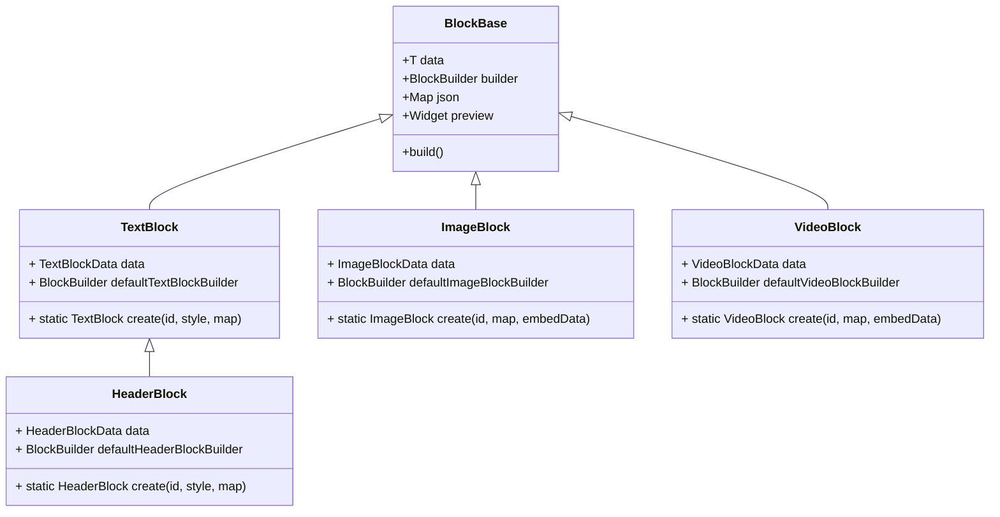
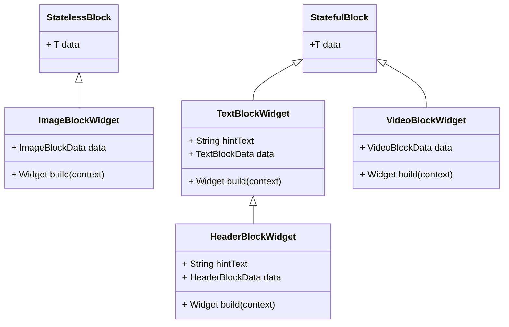
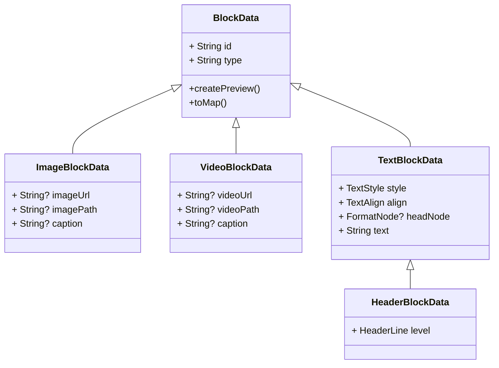
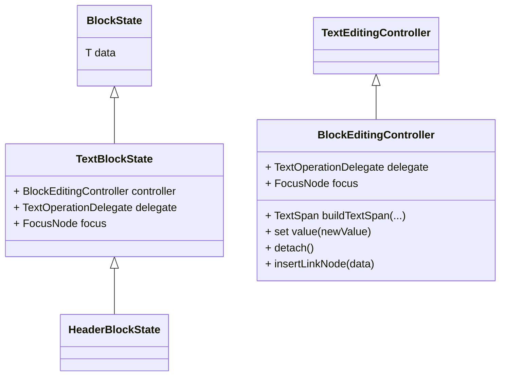
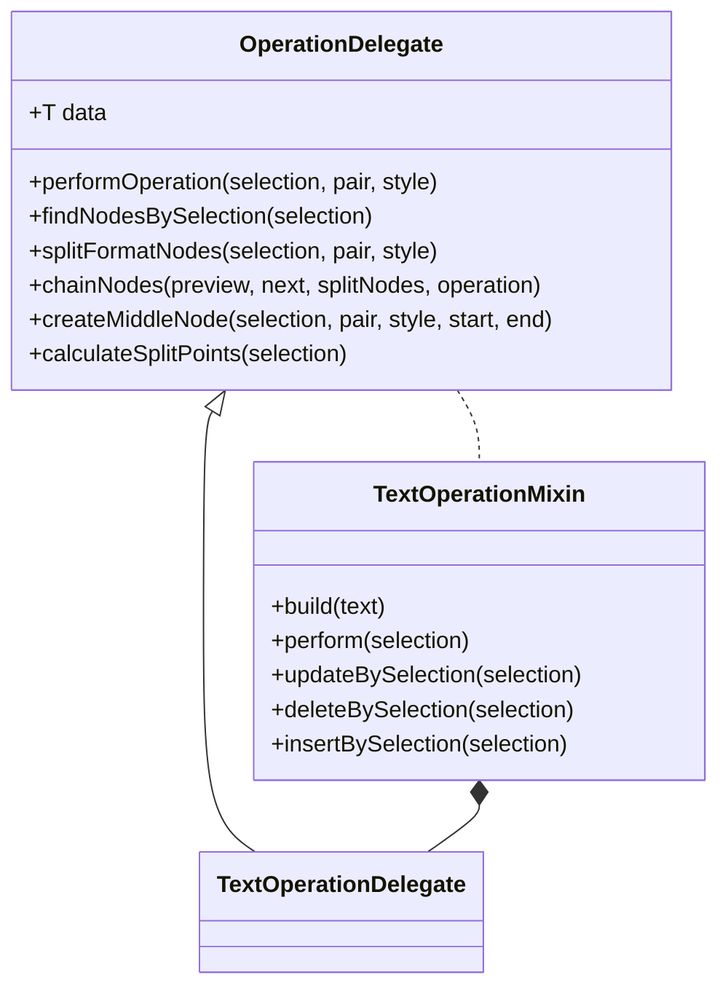
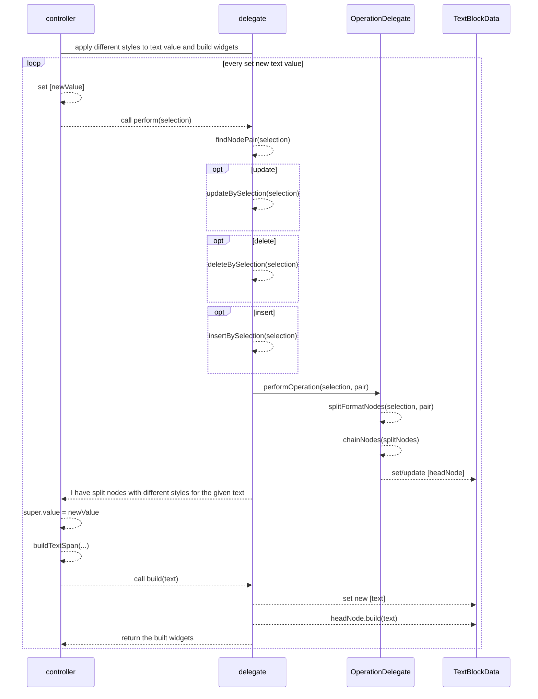

# weaver_editor

A minimum block-style rich text editor implementation.

# Design

### `WeaverEditor`
 - `WeaverEditor` will initialize from `EditorMetadata` which holds the `title`, `id` and `blocks` json data.
 - `EditorController


### Block Design

#### `BlockBase`



### `BlockBuilder`: `Widget Function(T data)`



### `BlockData`


### Editable Block State
- `controller` will perform operations by `delegate` before rendering its text

- `TextOperationMixin` will compose methods of `OperationDelegate` and expose the interfaces to `controller`



### how `BlockEditingController` build text spans with different text style by `TextOperationDelegate`


### how `EditorController` responds to user operations?
```mermaid
sequenceDiagram
    user->controller: perform operations
    loop every tap block control button
        user-->>controller: choose create/manage overlay
        controller-->>manager: create overlay
        manager-->>user: insert(overlay)
        user-->>manager: create/delete/move/drag
        manager-->>controller: insert/move/remove blocks
        opt insert block
            controller-->>factory: create(type)
            factory-->>controller: return a new block
        end
        opt move/remove block
            controller-->>BlockManageDelegate: perform operations
            BlockManageDelegate-->>controller: update [blocks]
        end
        controller-->>user: notify block operation completed
    end


